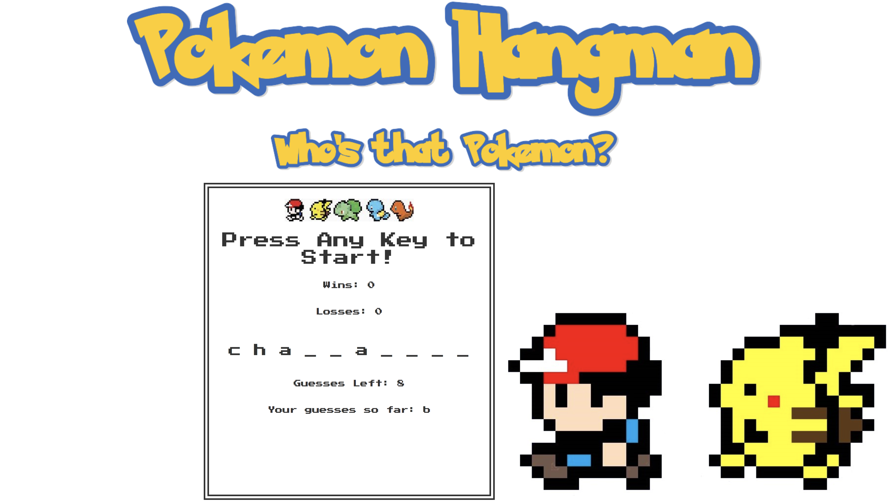
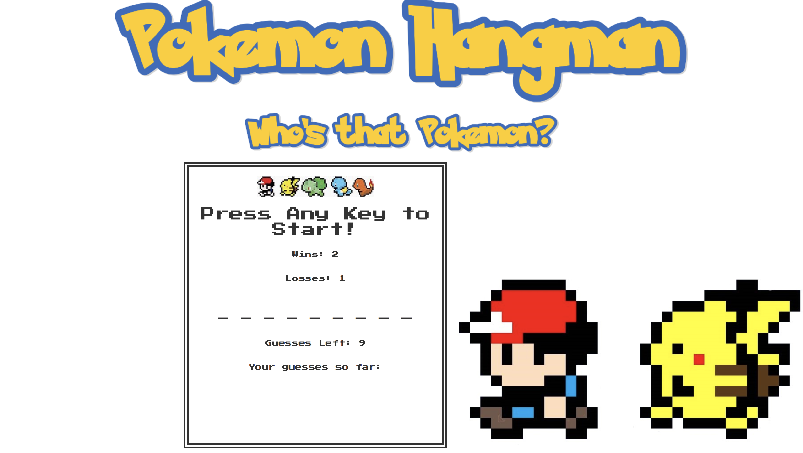

# Hangman-Game

Heres how the App Works:

On load an audio will play saying GUESS THAT POKEMON!
You can press any key to get started!
The game will then begin to show you whether you guessed a correct letter or not by either removing a dash and replacing it with the correct letters or show you your guess is wrong by placing it in the letters guessed area.

The game is also configured so that you may only guess one letter once.

If you completely guess the pokemon correctly with remaining guesses left an audio file will play signifying you have won and add a win to your counter. A new pokemon will be automatically generated to be guessed

If you run out of letters to guess and havent guessed the pokemon name yet it will add a loss counter to your losses and a new pokemon will be automaticalled generated to be guessed.

